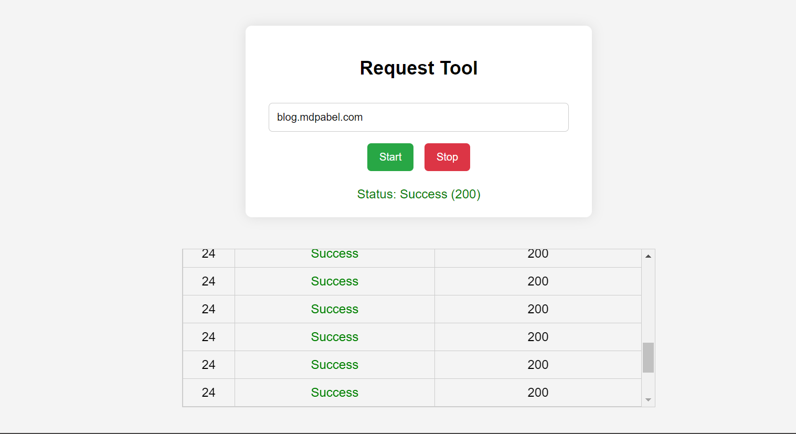
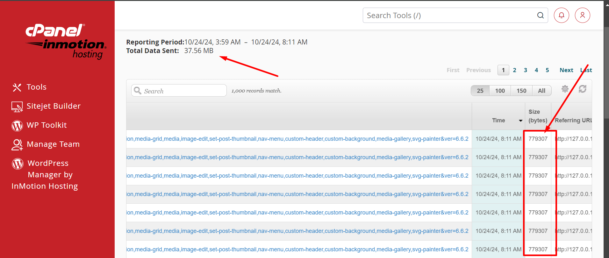

# WordPress Request Tool

This tool is designed to test the vulnerability in WordPress’s `load-scripts.php` file by simulating high-frequency requests to the target URL. It serves as a proof-of-concept (PoC) for understanding the impact of a Denial of Service (DoS) attack against WordPress sites.

## Table of Contents

- [Overview](#overview)
- [Security Note](#security-note)
- [How It Works](#how-it-works)
- [Setup Instructions](#setup-instructions)
- [Usage](#usage)
- [Features](#features)
- [Screenshots](#screenshots)

## Overview

WordPress is a widely used Content Management System (CMS), powering about 43.5% of websites globally. This tool tests the behavior of the `load-scripts.php` file, a core component in WordPress, to explore its potential vulnerability to DoS attacks.

> **Warning:** This tool is for educational and security research purposes only. Do not use it against any site without explicit permission from the site owner.

Screenshots

1. Environment Setup
   
2. cPanel Visitor Logs
   

## How It Works

The tool is built using HTML and JavaScript, and it sends multiple requests to the `load-scripts.php` endpoint of a WordPress website. The JavaScript code is executed in the browser and simulates high-frequency GET requests to check the response behavior.

## Setup Instructions

1. **Install Local CORS Proxy**

   To bypass CORS restrictions, we need a local proxy. Install [local-cors-proxy](https://www.npmjs.com/package/local-cors-proxy):

   ```bash
   npm install -g local-cors-proxy
   ```

2. **Run Local CORS Proxy**

Start the local CORS proxy to handle requests:

```bash
lcp --proxyUrl https://example.com
```

Replace https://example.com with the target WordPress URL.

3. **Launch the HTML Tool**

Save the HTML code provided in this repository as index.html.
Open the file in a browser.

## Usage

1. Enter the target domain (e.g., example.com) in the input field.
2. Click the Start button to initiate requests.
3. Observe the request statuses in the table below.
4. Click the Stop button to halt the requests.

## Features

1. Start/Stop Button: Start or stop requests manually.
2. Real-time Status: Displays the status of each request (success, failed, or error).
3. Request Table: Shows a running log of request status and response codes.
4. No Cache: Uses cache: 'no-store' to prevent using cached responses.
